<a name="readme-top"></a>

<div align="center">

<!-- 
# INVESTIGAÇÃO
-->

# 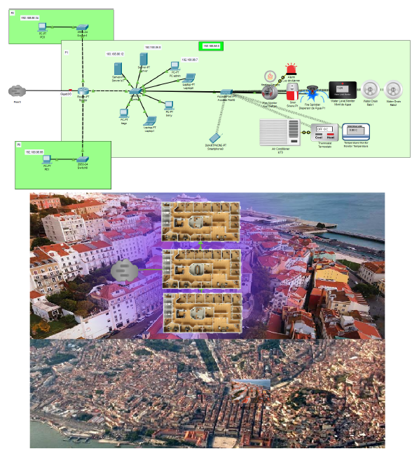

</div>

# Rede de Comunicações da XPTOtec

<table>
<tr>
<td>

> A empresa é de base tecnológica e fornece serviços inovadores para cidades inteligentes (smart cities), desenvolvendo hardware e software aplicado à Internet das Coisas (IoT). Prevê-se que a curto prazo a empresa possa duplicar os seus 120 funcionários atuais.

> Ambiente de edifícios inteligentes (smart building, onde o conceito da Internet das coisas (IoT) é fundamental.


</td>
</tr>
</table>

### Ferramentas e Tecnologias

[![Cisco][Cisco]][Cisco-url] [![Linux][Linux]][Linux-url] [![LaTeX][LaTeX]][LaTeX-url] [![Overleaf][Overleaf]][Overleaf-url]

<!-- 
[![C++][C++]][C++-url] [![JetBrains][JetBrains]][JetBrains-url] [![LaTeX][LaTeX]][LaTeX-url] [![Overleaf][Overleaf]][Overleaf-url]

[![Java][Java]][Java-url] [![JavaFX][JavaFX]][JavaFX-url] [![NetBeans][NetBeans]][NetBeans-url] [![Spring][Spring]][Spring-url] [![PostgreSQL][PostgreSQL]][PostgreSQL-url] [![MySQL][MySQL]][MySQL-url] [![SQLite][SQLite]][SQLite-url] [![Oracle][Oracle]][Oracle-url] [![Microsoft-SQL-Server][Microsoft-SQL-Server]][Microsoft-SQL-Server-url] [![LaTeX][LaTeX]][LaTeX-url] [![Overleaf][Overleaf]][Overleaf-url]
 
[![Cisco][Cisco]][Cisco-url] [![Linux][Linux]][Linux-url] [![LaTeX][LaTeX]][LaTeX-url] [![Overleaf][Overleaf]][Overleaf-url]

[![OCaml][OCaml]][OCaml-url] [![JetBrains][JetBrains]][JetBrains-url]

[![Assembly][Assembly]][Assembly-url] [![logisim-evolution][logisim-evolution]][logisim-evolution-url]

[![C++][C++]][C++-url] [![VS-Code][VS-Code]][VS-Code-url] [![LaTeX][LaTeX]][LaTeX-url] [![Makefile][Makefile]][Makefile-url]

[![Next][Next.js]][Next-url] [![React][React.js]][React-url] [![Bootstrap][Bootstrap.com]][Bootstrap-url] [![JQuery][JQuery.com]][JQuery-url]
-->

### Repositório GitHub

Após a entrega deste projeto ficará público :  https://github.com/Rede-de-Comunicacoes-da-XPTOtec

## Tomadas de Rede

> Ao nível da rede algumas decisões tiveramde ser tomadas, no nosso caso,
decidimos que cada edifício teria uma rede diferente, sendo que cada piso teria
aproximadamente 30 IPs disponíveis, mas com possibilidade de ter mais.
Assim sendo, cada piso teria uma tomada de rede, contabilizando no total 9
tomadas de rede(3 por edifício). Além das redes por prédio, tivemos de usar
outras redes para ligar os routers entre eles: para ligar os vários prédios foi
usada a rede 10.0.0.0, para conectar o router do Prédio do Oriente à internet e
aos diferentes routers que simulavam a mesma foi usada a rede 1.0.0.0. Finalmente,
a rede usada para diferenciar a rede principal da empresa da rede IOT
foi a 193.188.85.0,193.188.86.0 e 193.188.87.0 em cada prédio respetivamente.

## Edifício 1 (XPTOtecOriente)

### Planta e Pisos

> Admin Estático: ```192.188.85.1```

<div align="center">

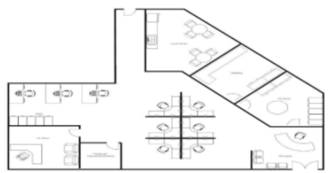

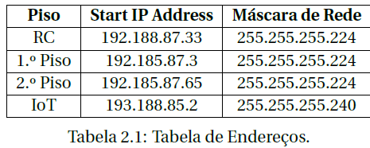

</div>

### Rede 

<div align="center">

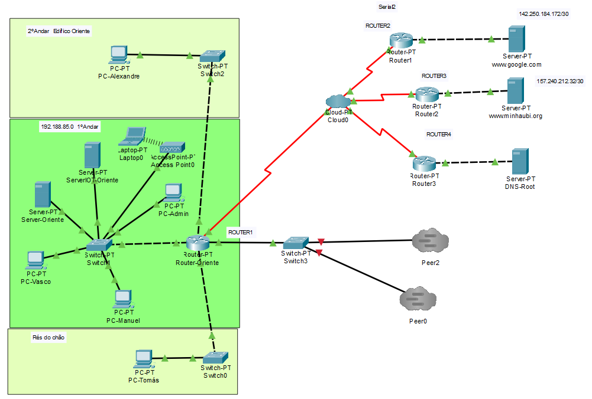

</div>

## Edifício 2 (XPTOtecNascente)

### Planta e Pisos

> Admin Estático: ```192.188.86.7```

<div align="center">

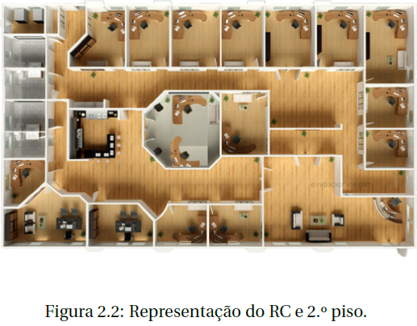

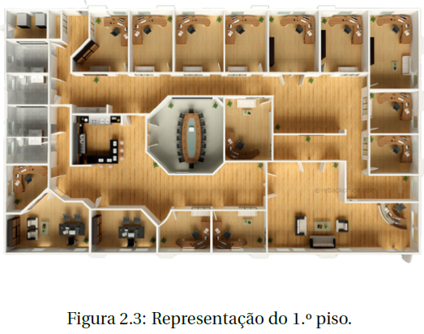

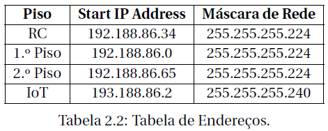

</div>

### Rede

<div align="center">

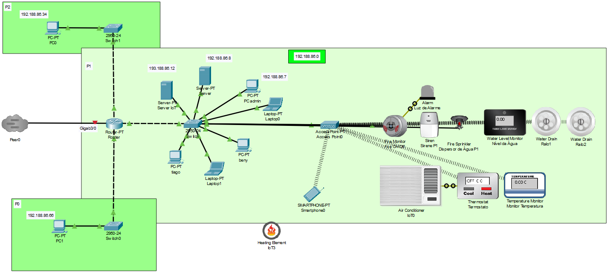

</div>

## Edifício 3 (XPTOtecLeste)

### Planta e Pisos

> Admin Estático: ```192.188.87.5```

<div align="center">

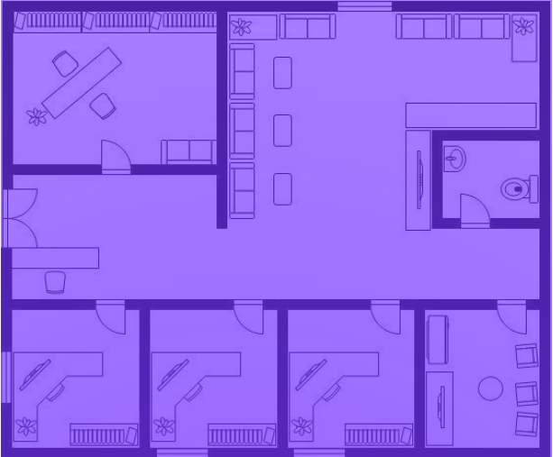

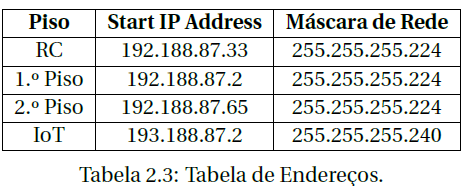

</div>

### Rede

<div align="center">

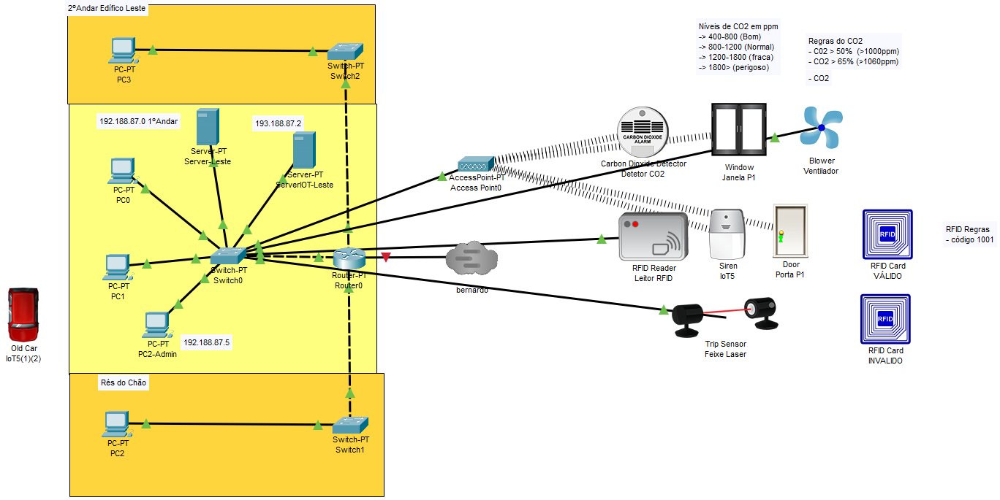

</div>

## Rede IOT (dispositivos/sensores/objetos)

### Painéis Solares Fotovoltaicos

<div align="center">

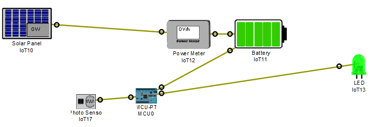

</div>

### Ralos para extração de água

<div align="center">

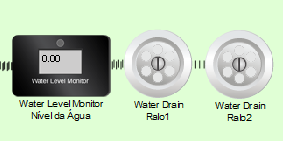

</div>

### Detetores de Incêndio

<div align="center">

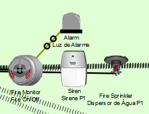

</div>

### Refrigeração e Aquecimento de ar automático

<div align="center">

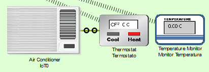

</div>

### Detetar Niveis de CO2

<div align="center">

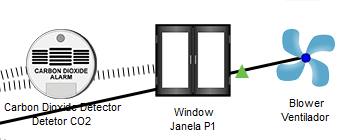

</div>

### Portas Controladas Eletronicamente por RFID e Feixes Laser

<div align="center">

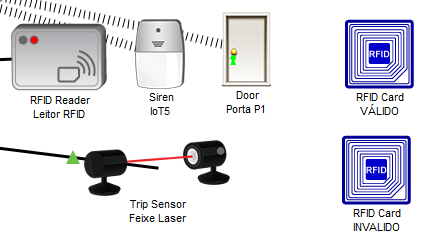

</div>

<!-- 

## Aplicação

### Header

<div align="center">


</div>

### Notícias

<div align="center">


</div>

### Contactos

<div align="center">


</div>

### Footer

<div align="center">


</div>

### Página de Login

<div align="center">


</div>

### Página de Registo

<div align="center">


</div>

### Pedido de Voluntariado

<div align="center">


</div>

### Reportar Incêndio

<div align="center">


</div>

### Menu introdutório
<div align="center">


</div>


### Operações sobre os Livros
<div align="center">


</div>

### Operações sobre os Clientes
<div align="center">


</div>

### Operações sobre as Encomendas
<div align="center">


</div>


### Página de Login


### Página de Registo


### Recuperar Password


### Landing Page


### Contratos


### Feedbacks


### Página Pessoal


### Reservar


### Calendário


### Planta do Cowork


### Ambiente da Administração


### Alguns Recursos


-->

<!-- 
### Como usar executar App?

- Instalar num dispositivo Android a aplicação ```play2learn.apk```.

> O tamanho da aplicação é superior ao permitido anexar nesta página, portanto se quiser experimentar a aplicação contacte-me nalgum dos endereços ao fundo desta página.

- O acesso ao SQL Server é feito através de um protocolo presente na Network
  Configuration, onde está encapsulado o protocolo TCP/IP.
  Este é um modelo robusto, rápido e confiável, sendo na atualidade praticamente
  indispensável.

- Deverá ser compilado utilizando o comando:
   ```sh
   gcc -o qqsm main main.c -Wall -std=c99
   ```
-->

<!-- 
- Acede ao website no URL de um browser: https://cowork-fundao.web.app/
-->

## Documentação

- [Linux](https://www.linux.org/)
- [Cisco Packet Tracer](https://www.netacad.com/courses/packet-tracer)
- [LaTeX](https://www.latex-project.org/)
- [Overleaf](https://www.overleaf.com/)

> Restante documentação encontra-se no Relatório presente no Repositório.

<!-- 
- [C++](https://www.cplusplus.com/doc/)
- [JetBrains](https://www.jetbrains.com/help/)
- [LaTeX](https://www.latex-project.org/help/documentation/)
- [Overleaf](https://www.overleaf.com/learn)
- [React](https://reactjs.org/docs/getting-started.html)
- [react-router-dom](https://reactrouter.com/web/guides/quick-start)
- [npm](https://www.npmjs.com/)
- [DataPicker](https://hypeserver.github.io/react-date-range/)
- [Date and Time Pickers - Validation](https://mui.com/x/react-date-pickers/validation/)
- [headless UI](https://headlessui.com/)
- [tailwindcss](https://v2.tailwindcss.com/docs/installation)
- [Firebase](https://firebase.google.com/docs)

> A restante documentação encontra-se no extenso Relatório Técnico estruturado mediante o desenvolvimento deste projeto.
-->

## Equipa de Desenvolvimento

[](https://github.com/Bernardoo10)|[](https://github.com/tiago-barreiros)
---|---
[Bernardo Claro](https://github.com/Bernardoo10)|[Tiago Barreiros](https://github.com/tiago-barreiros)

# Orientação

## [Prof. Doutor João Dias](https://www.ubi.pt/Pessoa/paulof)
## [Prof. Doutor Tiago Simões](https://www.di.ubi.pt/~inacio/)

## *Administração de Sistemas em Rede* @[Universidade da Beira Interior](https://www.ubi.pt/).

<!-- 
### Installation

_Below is an example of how you can instruct your audience on installing and setting up your app. This template doesn't rely on any external dependencies or services._

1. Get a free API Key at [https://example.com](https://example.com)
2. Clone the repo
   ```sh
   git clone https://github.com/your_username_/Project-Name.git
   ```
3. Install NPM packages
   ```sh
   npm install
   ```
4. Enter your API in `config.js`
   ```js
   const API_KEY = 'ENTER YOUR API';
   ```

<p align="right">(<a href="#readme-top">back to top</a>)</p>
-->

<!-- LICENSE -->
## License

Distributed under the MIT License. See `LICENSE.txt` for more information.

<!-- CONTACT -->
## Contact

<div> 
   <a href = "mailto:tiago.m.barreiros@gmail.com"></a>
  <a href="https://www.linkedin.com/in/tiago-barreiros/" target="_blank"></a> 
   <a href="https://discord.gg/537381363486031873" target="_blank"></a>
</div>

<p align="right">(<a href="#readme-top">back to top</a>)</p>

<!-- MARKDOWN LINKS & IMAGES -->
<!-- https://www.markdownguide.org/basic-syntax/#reference-style-links -->
[contributors-shield]: https://img.shields.io/github/contributors/othneildrew/Best-README-Template.svg?style=for-the-badge
[contributors-url]: https://github.com/othneildrew/Best-README-Template/graphs/contributors
[forks-shield]: https://img.shields.io/github/forks/othneildrew/Best-README-Template.svg?style=for-the-badge
[forks-url]: https://github.com/othneildrew/Best-README-Template/network/members
[stars-shield]: https://img.shields.io/github/stars/othneildrew/Best-README-Template.svg?style=for-the-badge
[stars-url]: https://github.com/othneildrew/Best-README-Template/stargazers
[issues-shield]: https://img.shields.io/github/issues/othneildrew/Best-README-Template.svg?style=for-the-badge
[issues-url]: https://github.com/othneildrew/Best-README-Template/issues
[license-shield]: https://img.shields.io/github/license/othneildrew/Best-README-Template.svg?style=for-the-badge
[license-url]: https://github.com/othneildrew/Best-README-Template/blob/master/LICENSE.txt
[linkedin-shield]: https://img.shields.io/badge/-LinkedIn-black.svg?style=for-the-badge&logo=linkedin&colorB=555
[linkedin-url]: https://linkedin.com/in/othneildrew
[Next.js]: https://img.shields.io/badge/next.js-000000?style=for-the-badge&logo=nextdotjs&logoColor=white
[Next-url]: https://nextjs.org/
[React.js]: https://img.shields.io/badge/React-20232A?style=for-the-badge&logo=react&logoColor=61DAFB
[React-url]: https://reactjs.org/
[C++]: https://img.shields.io/badge/C++-00599C?style=for-the-badge&logo=cplusplus&logoColor=white
[C++-url]: https://www.cplusplus.com/
[C]: https://img.shields.io/badge/C-00599C?style=for-the-badge&logo=c&logoColor=white
[C-url]: https://www.cprogramming.com/
[C#]: https://img.shields.io/badge/C%23-239120?style=for-the-badge&logo=csharp&logoColor=white
[C#-url]: https://docs.microsoft.com/en-us/dotnet/csharp/
[VS-Code]: https://img.shields.io/badge/VS_Code-0078D4?style=for-the-badge&logo=visualstudiocode&logoColor=white
[VS-Code-url]: https://code.visualstudio.com/
[Vue.js]: https://img.shields.io/badge/Vue.js-35495E?style=for-the-badge&logo=vuedotjs&logoColor=4FC08D
[Vue-url]: https://vuejs.org/
[Angular.io]: https://img.shields.io/badge/Angular-DD0031?style=for-the-badge&logo=angular&logoColor=white
[Angular-url]: https://angular.io/
[Svelte.dev]: https://img.shields.io/badge/Svelte-4A4A55?style=for-the-badge&logo=svelte&logoColor=FF3E00
[Svelte-url]: https://svelte.dev/
[Laravel.com]: https://img.shields.io/badge/Laravel-FF2D20?style=for-the-badge&logo=laravel&logoColor=white
[Laravel-url]: https://laravel.com
[Bootstrap.com]: https://img.shields.io/badge/Bootstrap-563D7C?style=for-the-badge&logo=bootstrap&logoColor=white
[Bootstrap-url]: https://getbootstrap.com
[JQuery.com]: https://img.shields.io/badge/jQuery-0769AD?style=for-the-badge&logo=jquery&logoColor=white
[JQuery-url]: https://jquery.com
[LaTex]: https://img.shields.io/badge/LaTeX-47A141?style=for-the-badge&logo=latex&logoColor=white
[LaTex-url]: https://www.latex-project.org/
[Makefile]: https://img.shields.io/badge/Makefile-003366?style=for-the-badge&logo=gnu&logoColor=white
[Makefile-url]: https://www.gnu.org/software/make/
[Assembly]: https://img.shields.io/badge/Assembly-000000?style=for-the-badge&logo=assemblyscript&logoColor=white
[Assembly-url]: https://www.assemblyscript.org/
[logisim-evolution]: https://img.shields.io/badge/Logisim_Evolution-FF2D20?style=for-the-badge&logo=logisim&logoColor=white
[logisim-evolution-url]: https://www.logisim.org/
[OCaml]: https://img.shields.io/badge/OCaml-EC6813?style=for-the-badge&logo=ocaml&logoColor=white
[OCaml-url]: https://ocaml.org/
[JetBrains]: https://img.shields.io/badge/JetBrains-000000?style=for-the-badge&logo=jetbrains&logoColor=white
[JetBrains-url]: https://www.jetbrains.com/
[Overleaf]: https://img.shields.io/badge/Overleaf-47A141?style=for-the-badge&logo=overleaf&logoColor=white
[Overleaf-url]: https://www.overleaf.com/
[Linux]: https://img.shields.io/badge/Linux-FCC624?style=for-the-badge&logo=linux&logoColor=black
[Linux-url]: https://www.linux.org/
[Cisco]: https://img.shields.io/badge/Cisco-1BA0D7?style=for-the-badge&logo=cisco&logoColor=white
[Cisco-url]: https://www.cisco.com/
[Arduino]: https://img.shields.io/badge/Arduino-00979D?style=for-the-badge&logo=arduino&logoColor=white
[Arduino-url]: https://www.arduino.cc/
[Scanner]: https://img.shields.io/badge/Scanner-000000?style=for-the-badge&logo=scanner&logoColor=white
[Scanner-url]: https://www.scanner.com/
[Java]: https://img.shields.io/badge/Java-ED8B00?style=for-the-badge&logo=java&logoColor=white
[Java-url]: https://www.java.com/
[JavaFX]: https://img.shields.io/badge/JavaFX-ED8B00?style=for-the-badge&logo=java&logoColor=white
[JavaFX-url]: https://openjfx.io/
[NetBeans]: https://img.shields.io/badge/NetBeans-1B6AC6?style=for-the-badge&logo=apache-netbeans-ide&logoColor=white
[NetBeans-url]: https://netbeans.apache.org/
[Spring]: https://img.shields.io/badge/Spring-6DB33F?style=for-the-badge&logo=spring&logoColor=white
[Spring-url]: https://spring.io/
[PostgreSQL]: https://img.shields.io/badge/PostgreSQL-316192?style=for-the-badge&logo=postgresql&logoColor=white
[PostgreSQL-url]: https://www.postgresql.org/
[MySQL]: https://img.shields.io/badge/MySQL-00000F?style=for-the-badge&logo=mysql&logoColor=white
[MySQL-url]: https://www.mysql.com/
[SQLite]: https://img.shields.io/badge/SQLite-07405E?style=for-the-badge&logo=sqlite&logoColor=white
[SQLite-url]: https://www.sqlite.org/
[Oracle]: https://img.shields.io/badge/Oracle-F80000?style=for-the-badge&logo=oracle&logoColor=white
[Oracle-url]: https://www.oracle.com/
[Microsoft-SQL-Server]: https://img.shields.io/badge/Microsoft_SQL_Server-CC2927?style=for-the-badge&logo=microsoft-sql-server&logoColor=white
[Microsoft-SQL-Server-url]: https://www.microsoft.com/en-us/sql-server
[Python]: https://img.shields.io/badge/Python-3776AB?style=for-the-badge&logo=python&logoColor=white
[Python-url]: https://www.python.org/
[Audacity]: https://img.shields.io/badge/Audacity-0000CC?style=for-the-badge&logo=audacity&logoColor=white
[Audacity-url]: https://www.audacityteam.org/
[Discord]: https://img.shields.io/badge/Discord-7289DA?style=for-the-badge&logo=discord&logoColor=white
[Discord-url]: https://discord.com/
[Swing]: https://img.shields.io/badge/Swing-007396?style=for-the-badge&logo=java&logoColor=white
[Swing-url]: https://docs.oracle.com/javase/tutorial/uiswing/
[FXML]: https://img.shields.io/badge/FXML-007396?style=for-the-badge&logo=java&logoColor=white
[FXML-url]: https://openjfx.io/javadoc/11/javafx.fxml/javafx/fxml/doc-files/introduction_to_fxml.html
[SceneBuilder]: https://img.shields.io/badge/SceneBuilder-007396?style=for-the-badge&logo=java&logoColor=white
[SceneBuilder-url]: https://gluonhq.com/products/scene-builder/
[HTML5]: https://img.shields.io/badge/HTML5-E34F26?style=for-the-badge&logo=html5&logoColor=white
[HTML5-url]: https://developer.mozilla.org/en-US/docs/Web/Guide/HTML/HTML5
[CSS3]: https://img.shields.io/badge/CSS3-1572B6?style=for-the-badge&logo=css3&logoColor=white
[CSS3-url]: https://developer.mozilla.org/en-US/docs/Web/CSS
[PHP]: https://img.shields.io/badge/PHP-777BB4?style=for-the-badge&logo=php&logoColor=white
[PHP-url]: https://www.php.net/
[JavaScript]: https://img.shields.io/badge/JavaScript-F7DF1E?style=for-the-badge&logo=javascript&logoColor=black
[JavaScript-url]: https://developer.mozilla.org/en-US/docs/Web/JavaScript
[TypeScript]: https://img.shields.io/badge/TypeScript-007ACC?style=for-the-badge&logo=typescript&logoColor=white
[TypeScript-url]: https://www.typescriptlang.org/
[React]: https://img.shields.io/badge/React-20232A?style=for-the-badge&logo=react&logoColor=61DAFB
[React-url]: https://reactjs.org/
[Node.js]: https://img.shields.io/badge/Node.js-43853D?style=for-the-badge&logo=node.js&logoColor=white
[Node.js-url]: https://nodejs.org/en/
[GLSL]: https://img.shields.io/badge/GLSL-5586A4?style=for-the-badge&logo=opengl&logoColor=white
[GLSL-url]: https://www.khronos.org/opengl/wiki/OpenGL_Shading_Language
[OpenGL]: https://img.shields.io/badge/OpenGL-5586A4?style=for-the-badge&logo=opengl&logoColor=white
[OpenGL-url]: https://www.opengl.org/
[Visual-Studio]: https://img.shields.io/badge/Visual_Studio-5C2D91?style=for-the-badge&logo=visual-studio&logoColor=white
[Visual-Studio-url]: https://visualstudio.microsoft.com/
[Trello]: https://img.shields.io/badge/Trello-0079BF?style=for-the-badge&logo=trello&logoColor=white
[Trello-url]: https://trello.com/
[Figma]: https://img.shields.io/badge/Figma-F24E1E?style=for-the-badge&logo=figma&logoColor=white
[Figma-url]: https://www.figma.com/
[Creately]: https://img.shields.io/badge/Creately-FF8000?style=for-the-badge&logo=creately&logoColor=white
[Creately-url]: https://creately.com/
[Android-Studio]: https://img.shields.io/badge/Android_Studio-3DDC84?style=for-the-badge&logo=android-studio&logoColor=white
[Android-Studio-url]: https://developer.android.com/studio
[Firebase]: https://img.shields.io/badge/Firebase-FFCA28?style=for-the-badge&logo=firebase&logoColor=white
[Firebase-url]: https://firebase.google.com/
